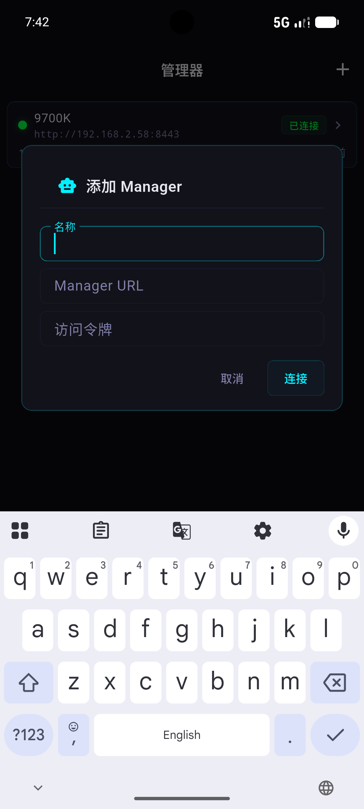
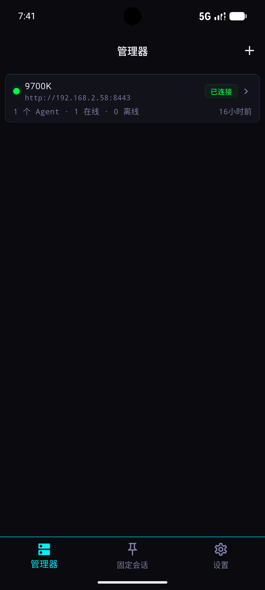
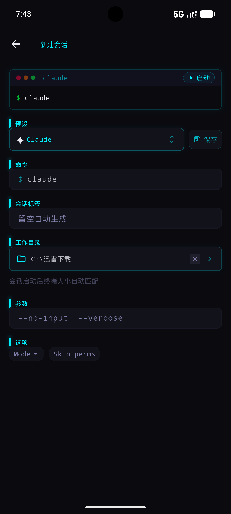
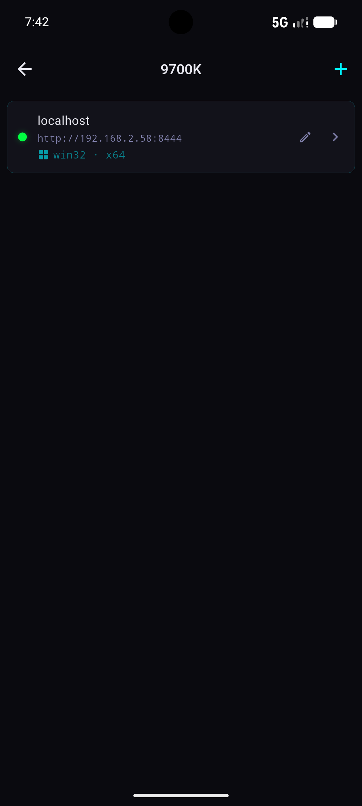
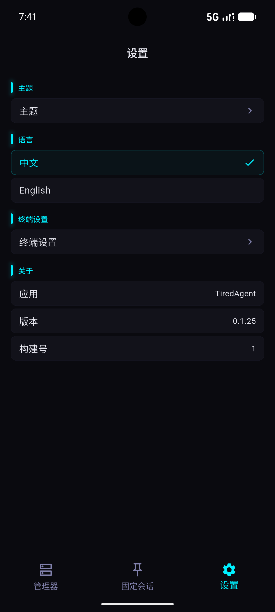
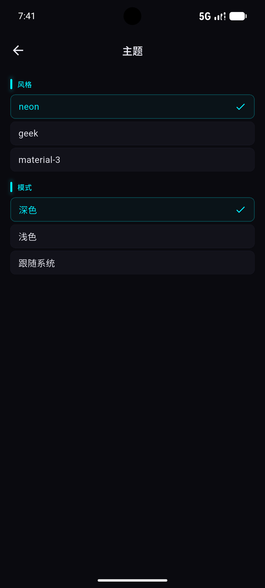

# tired_agent_app

[English](README.md) · [中文](README.zh-CN.md)

[](https://flutter.dev)
[](https://github.com/clssw1004/tired-agent-app)
[](https://github.com/clssw1004/tired-agent)

tiredAgentMobile — a Flutter client for tired-agent (Android / Windows / Linux).

Connect to a tired-agent Manager service to manage agents, sessions and terminals.

## Backend

This project is the frontend client of [tired-agent](https://github.com/clssw1004/tired-agent). The backend implements the Manager / Agent services in TypeScript; the protocol is defined in [@tired-agent/protocol](https://www.npmjs.com/package/@tired-agent/protocol) and mirrored in Dart under `lib/protocol/`.

## Getting Started

```bash
flutter pub get
flutter run          # launch on device / emulator
flutter test         # run tests
```

## Screenshots

### Managers & Agents

| | |
|---|---|
|  Add Manager |  Managers and agents |

### Sessions & Terminal

| | |
|---|---|
|  New session |  Sessions |

### Settings

| | |
|---|---|
|  Settings |  Theme |

## Structure

| Module | Description |
|---|---|
| `screens/` | UI layer (go_router routes) |
| `providers/` | State management (Provider + ChangeNotifier) |
| `protocol/` | Dart mirror of the protocol (hand-written from TypeScript) |
| `widgets/pty_session_view.dart` | xterm2 terminal view + custom keyboard bridge |
